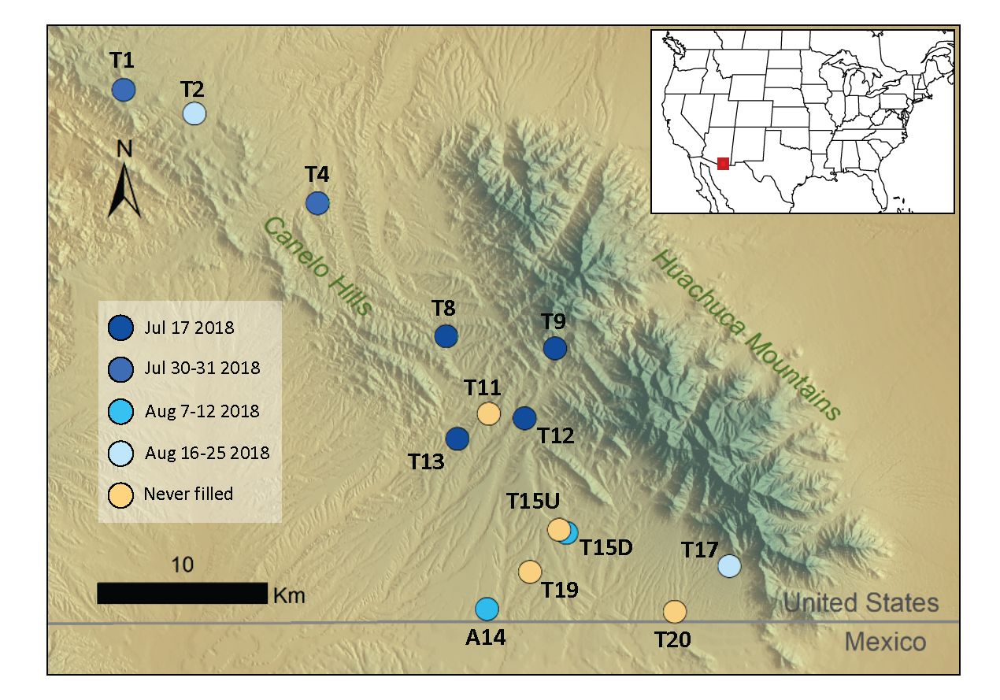

# PondsProject
Mims Lab Arizona Ponds Project Repo for temperature sensor data and hydroperiod analysis. 

Code for estimating pond inundation dates from temperature sensor data using hidden Markov models is provided in the following file: Gendreau_WRR_2021_Pond_HMM_R_Code.md 

